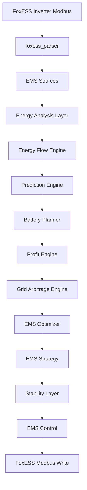
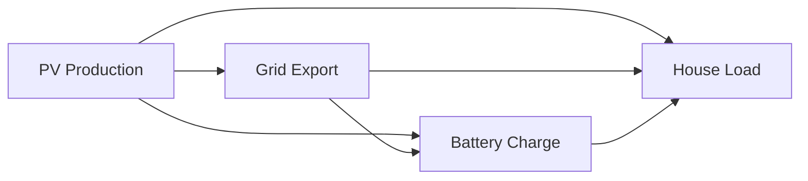

# FoxESS EMS for Home Assistant

## Overview

This project implements a **modular Energy Management System (EMS)** for **FoxESS inverters** integrated with **Home Assistant via Modbus TCP**.

The EMS automatically optimizes energy usage, battery charging, and grid interaction based on:

- PV production
- household consumption
- battery state of charge
- grid tariffs (G13)
- export energy prices
- forecasted production and demand
- grid arbitrage opportunities

The system is designed as a **layered architecture**, where each module performs a clearly defined task.

---

# System Architecture



---

# Project Structure

```
packages/
│
├── foxess_parser.yaml
├── ems_sources.yaml
│
├── ems_analysis.yaml
├── ems_energy_state.yaml
├── ems_energy_flow.yaml
│
├── ems_tariff_g13.yaml
├── ems_export_price.yaml
├── ems_profit_engine.yaml
├── ems_grid_arbitrage.yaml
│
├── ems_prediction_engine.yaml
├── ems_adaptive_learning.yaml
│
├── ems_battery_planner.yaml
│
├── ems_optimizer.yaml
├── ems_strategy.yaml
├── ems_stability_layer.yaml
│
├── ems_control.yaml
├── ems_control_panel.yaml
│
├── ems_system_monitor.yaml
├── ems_diagnostics.yaml
│
└── ems_helpers.yaml
```

Total modules: ~20

---

# Energy Flow Model

The EMS builds a virtual model of energy movement inside the house.



This model allows the EMS to determine:

- PV surplus
- grid import/export
- battery usage
- energy balance errors

---

# Core EMS Sensors

## Source Sensors (FoxESS)

- sensor.pv_power
- sensor.load_power
- sensor.grid_power
- sensor.battery_power
- sensor.battery_soc

## Energy Analysis

- sensor.ems_pv_surplus
- sensor.ems_pv_surplus_level
- sensor.ems_battery_state
- sensor.ems_grid_state
- sensor.ems_power_balance

## Forecast & Prediction

- sensor.ems_pv_forecast_energy_today
- sensor.ems_load_forecast_today
- sensor.ems_energy_balance_forecast
- sensor.ems_target_battery_soc

## Battery Planning

- sensor.ems_battery_capacity
- sensor.ems_battery_stored_energy
- sensor.ems_required_energy_today
- sensor.ems_planned_battery_reserve
- sensor.ems_planned_battery_soc

## Economic Engine

- sensor.ems_export_price
- sensor.ems_import_price
- sensor.ems_stored_energy_value
- sensor.ems_profit_decision

## Arbitrage Engine

- sensor.ems_arbitrage_margin
- sensor.ems_arbitrage_opportunity
- sensor.ems_arbitrage_action

## Optimizer

- sensor.ems_economic_score
- sensor.ems_energy_score
- sensor.ems_battery_score
- sensor.ems_optimizer_decision

## Strategy

- sensor.ems_energy_strategy
- sensor.ems_foxess_mode

## Monitoring

- sensor.ems_system_status
- sensor.ems_current_strategy
- sensor.ems_arbitrage_status
- sensor.ems_summary

## Diagnostics

- sensor.ems_sensor_health
- sensor.ems_energy_balance_check
- sensor.ems_strategy_stability
- sensor.ems_system_health

Total sensors: ~70+

---

# Decision Logic

EMS strategy follows strict priority rules:

1️⃣ Manual Override (Control Panel)

2️⃣ Battery Protection  
Battery SOC < critical threshold → force charge

3️⃣ Profit Engine  
If export price > stored energy value → export

4️⃣ Grid Arbitrage  
If import cheap & export expensive → charge

5️⃣ Cheap Tariff Charging  
Charge battery during low tariff periods

6️⃣ PV Surplus Charging  
Store excess PV energy

7️⃣ PV Export  
Sell excess energy when battery is full

8️⃣ Default Self Consumption

---

# Safety Mechanisms

The EMS includes multiple safety layers:

### Write‑If‑Changed Protection
Prevents repeated writes to FoxESS registers.

### Strategy Stability Layer
Prevents rapid strategy oscillations.

### Energy Balance Diagnostics
Detects invalid power readings.

### Sensor Health Monitoring
Detects unavailable or invalid sensors.

---

# Current System Capabilities

The EMS currently supports:

- automated battery management
- dynamic energy export decisions
- tariff‑aware charging
- PV surplus optimization
- grid arbitrage
- predictive energy planning
- modular Home Assistant architecture

---

# Future Improvements

Planned upgrades:

- weather‑based PV forecasting
- AI load prediction
- battery degradation optimization
- dynamic energy market integration
- advanced dashboard visualization

---

# Author Notes

This EMS was designed specifically for **FoxESS + Home Assistant advanced installations**.

The architecture is intentionally modular so individual engines (prediction, optimizer, control) can evolve independently.
